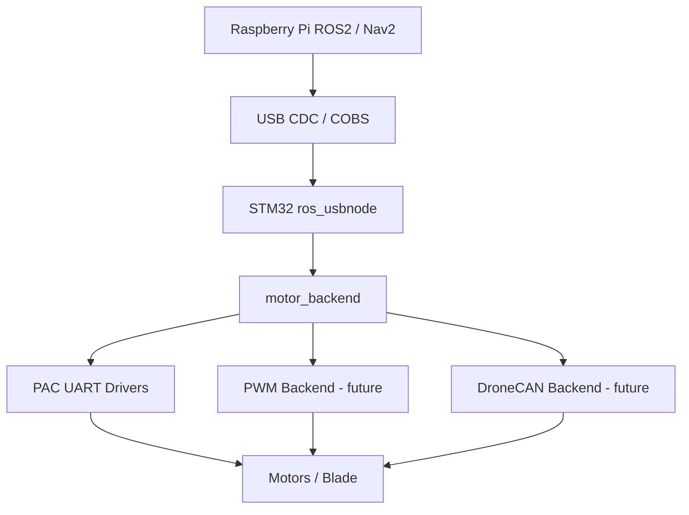

# Firmware

STM32 firmware for Mowgli robot mower — motor control, IMU, blade safety, and ROS2 serial bridge.

Forked from [cloudn1ne/Mowgli](https://github.com/cloudn1ne/Mowgli).

---

## Safety

> The custom firmware has no tilt sensing or emergency stop — **remove razor blades during development**.

---

## Structure

```text
stm32/
├── ros_usbnode/        # Main firmware: ROS serial bridge over USB-CDC (STM32F103 / STM32F401)
├── custom_panel_fw/    # Custom panel controller (STM32F0)
├── test_code/          # Hardware test/debug firmware
├── mainboard_firmware/ # Stock firmware backup/restore tools
└── panel_firmware/     # Stock panel firmware backup/restore tools
```

---

## Main Firmware (`ros_usbnode`)

The active firmware in `stm32/ros_usbnode/` runs on STM32-based Yardforce mainboards and provides:

- Motor control (left/right wheels, blade)
- IMU reading (accelerometer, gyroscope, magnetometer)
- Battery voltage and charging state
- Rain sensor, emergency/stop buttons
- USB-CDC serial bridge to ROS2 (via COBS protocol)

---

## Motor Control Architecture

> Motor backend abstraction recently introduced — enabling future support for PWM and DroneCAN ESCs.

A **motor abstraction layer** (`motor_backend`) has been introduced to decouple ROS control logic from hardware-specific motor drivers.

### Before

```text
ROS → DRIVEMOTOR / BLADEMOTOR (direct calls)
```

### Now

```text
ROS → motor_backend → hardware drivers
```

---

### System Diagram



---

### Purpose

- Isolate hardware-specific code
- Simplify future hardware upgrades
- Support multiple motor technologies
- Improve maintainability
- Keep ROS / MAVROS / Nav2 logic independent from the motor driver implementation

---

### Motor Backend API

```c
bool motor_backend_init(void);
void motor_backend_set_type(motor_backend_type_t type);

bool motor_set_drive_pwm(int16_t left, int16_t right);
bool motor_set_blade_pwm(int16_t pwm);

bool motor_get_feedback(motor_feedback_t *feedback);
bool motor_backend_is_healthy(void);
```

#### Drive motor command

```c
motor_set_drive_pwm(int16_t left, int16_t right);
```

#### Blade motor command

```c
motor_set_blade_pwm(int16_t pwm);
```

| Value | Meaning |
|------:|---------|
| `0` | stop |
| `> 0` | forward |
| `< 0` | reverse |

---

### Safety

Motor commands are clamped in the backend layer:

```c
#define MOTOR_PWM_MAX 1000
```

This prevents invalid or unsafe values from ROS from reaching the low-level motor drivers.

Additional safety remains handled by the firmware emergency layer and the ROS command watchdog.

---

### Current Backend

#### PAC UART (default)

The current backend targets the original Yardforce motor controller hardware:

- Original Yardforce PAC motor drivers
- UART communication
- Existing wheel motor command protocol
- Existing blade motor command protocol
- Partial blade telemetry available

---

### Planned Backends

#### PWM Backend

Planned for simple ESC control.

Expected characteristics:

- Direct PWM command output
- Minimal or no telemetry
- Optional GPIO feedback/fault input

#### DroneCAN Backend

Planned for modern ESCs such as VESC or AM32 with DroneCAN support.

Expected telemetry:

- RPM
- Current
- Voltage
- Temperature
- Faults
- ESC status

This backend should allow VESC and AM32 DroneCAN ESCs to share the same high-level motor API.

---

### Feedback

The backend exposes a generic feedback structure:

```c
bool motor_get_feedback(motor_feedback_t *feedback);
```

Currently available:

- Blade RPM
- Fault flags

Planned:

- Wheel RPM
- Power consumption
- Current
- Temperature
- DroneCAN telemetry

---

### Why this matters

This architecture allows:

- Switching motor hardware without modifying ROS logic
- Testing multiple motor control strategies
- Integrating modern ESCs such as VESC or AM32
- Keeping legacy Yardforce support while preparing future hardware
- Improving long-term scalability and maintainability

---

## HAL and Board Abstraction

The firmware is being progressively refactored around a HAL and board abstraction model.

Current abstraction layers include:

- GPIO
- UART
- PWM
- ADC snapshot
- I2C
- soft I2C GPIO access
- time / delays
- RTC backup storage
- board-level pin mapping

The goal is to isolate STM32-specific code from application logic and make future ports easier, including ESP32-based variants.

---

## Building

Requires [PlatformIO](https://platformio.org/).

```bash
cd stm32/ros_usbnode
pio run
```

To build specific variants:

```bash
pio run -e Yardforce500
pio run -e Yardforce500B
```

---

## Flashing

Flash via the GUI setup page (recommended) or with an ST-Link:

```bash
pio run --target upload
```

For a specific environment:

```bash
pio run -e Yardforce500 --target upload
pio run -e Yardforce500B --target upload
```

---

## Supported Hardware

- YardForce Classic 500
- YardForce Classic 500B
- YardForce LUV1000Ri

Board-specific hardware settings are still partly defined in `stm32/ros_usbnode/include/board.h`.

New code should avoid directly depending on `board.h` when possible and should use the newer abstraction layers instead:

- `board_config.h`
- `robot_config.h`
- `motor_backend.h`
- `hal/*`

---

## Development Notes

- `.h` files should contain declarations only.
- `.c` / `.cpp` files should contain implementation logic.
- New motor control logic should go through `motor_backend`.
- New hardware access should go through the HAL abstraction where possible.
- Legacy STM32 initialization code may still use STM32 HAL directly until fully migrated.

---

## Roadmap

- [x] Introduce HAL wrappers for core runtime access
- [x] Add board-level pin abstraction
- [x] Add motor backend abstraction
- [x] Route ROS motor commands through `motor_backend`
- [ ] Implement PWM motor backend
- [ ] Implement DroneCAN backend for VESC / AM32
- [ ] Add full motor telemetry abstraction
- [ ] Improve runtime backend selection
- [ ] Continue separating legacy `board.h` into focused config headers
- [ ] Prepare future ESP32 panel/backend support
